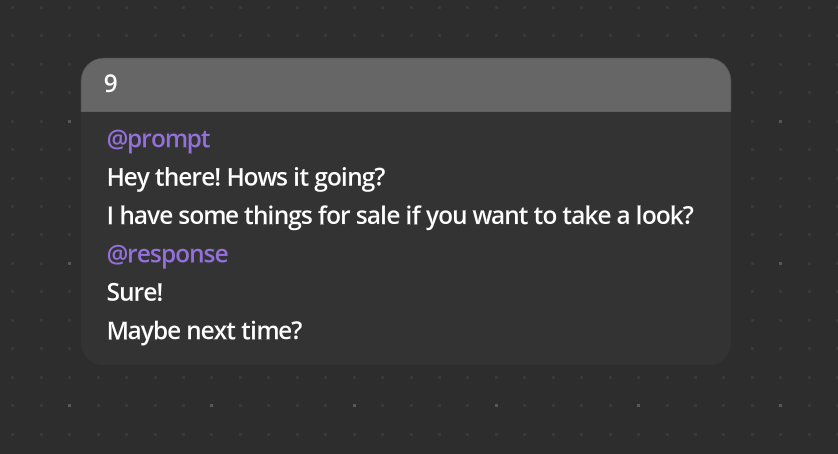
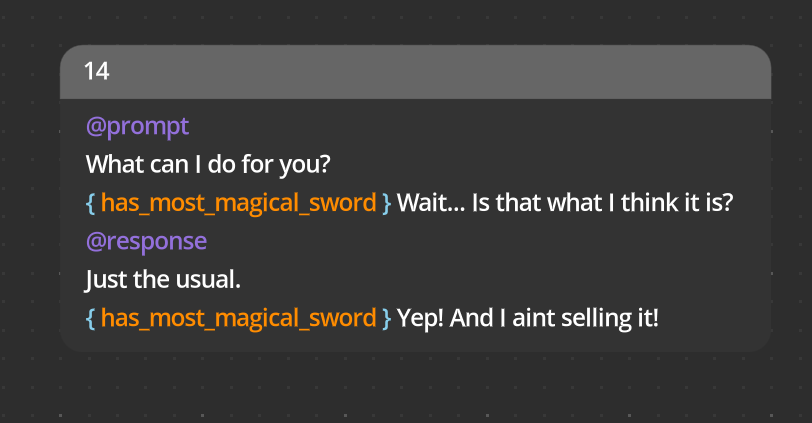
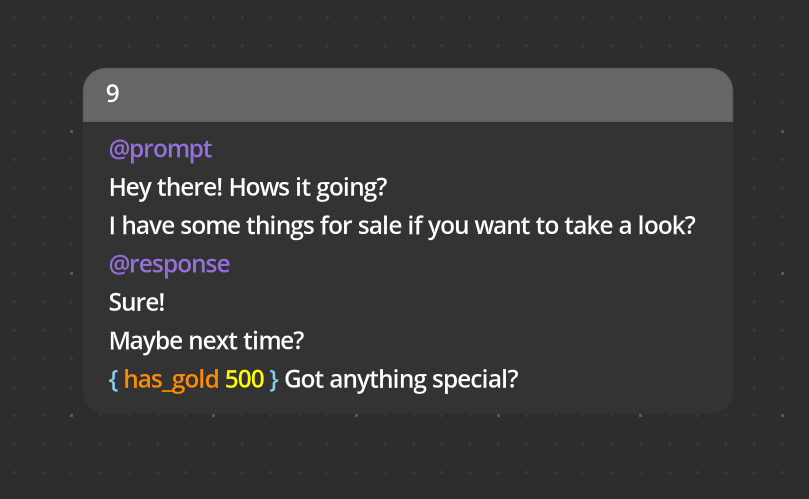
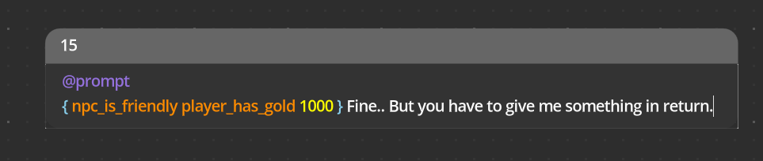
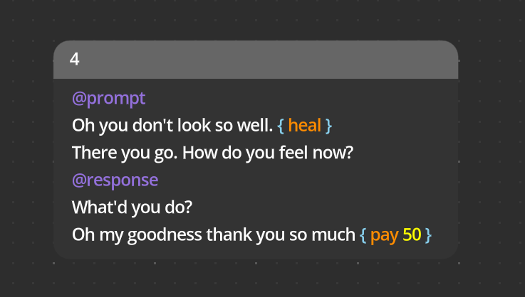
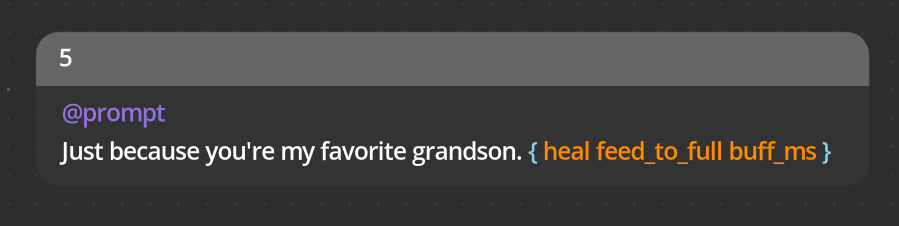
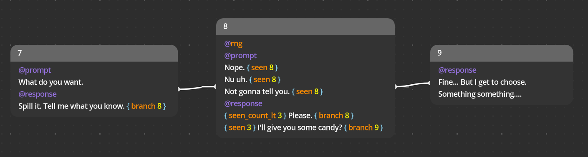
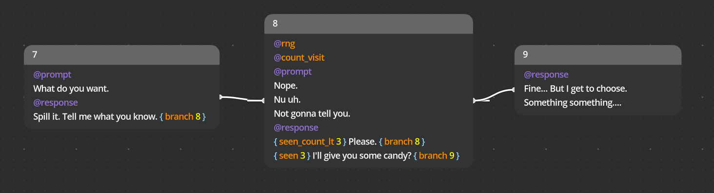

# how to write oasis dialogue

## Summary

* Text spoken by the character are listed under the `@prompt` header.
* Text to be chosen by the player are written under the `@response` header.
* Prompts and actions may have conditions, notated by a `{}` **before** the text to be displayed, containing names of conditions that, if all resolve true at runtime, proceed to show the prompt/response.
* Prompts and actions may have actions, notated by a `{}` **after** the text to be displayed, containing names of actions to execute at runtime.
* Conditions and actions may optionally have a numeric value.
* Annotations are mainly used to alter how prompts are displayed, but can be used to customize branch behavior.

## conditions

If you want to show a prompt or response under a condition(s), put a `{}` **before** the text to be displayed. Conditions must **only containing letters and `_`** (no numbers and special characters). Conditions are completely made up by you, the writer.

> The prompt `Wait... Is that what I think it is?` and response `Yep! And I ain't selling it!` will only show if the player has the *most magical sword*.

A condition may **optionally be succeeded by a numeric value**.

> `Got anything special?` will only show to the player if the player has at least 500 gold.

Lines are only shown **if all conditions specified are true**.

## actions

Similar to conditions, to execute code at runtime when a prompt is displayed or response is chosen, put a `{}` **after** the text to be displayed. Actions must **only contain letters and `_`** (no numbers and special characters), and like conditions, actions may **optionally be succeeded by a numeric value**. Actions are completely made up by you, the writer.

And may contain multiple actions...

> **Note**: Actions are executed in the order specified. For example... `{ set_gold 10 set_gold 3 }` will conclude with the player's gold being set to 3.

## annotations part I

Annotations can get complicated. The simple part of them is that you use them to change how prompts are displayed.

By default, prompts are displayed sequentially via the `seq` annotation. If you wanted a single prompt to be chosen at random and displayed, you can use the `@rng` notation. Annotations must be specified at the top of the branch before prompts and responses.

There are only 2 annotations provided out of the box, `@seq` and `@rng`. Any other annotation you use will have to be [implemented by the developer](how_to_implement.md). These, like actions and conditions, are completely made up by you, the writer.

Some examples of annotations could be the following *(made up naming by me that's makes sense)*:
* `@block`: display all prompts in the branch as if it was one huge prompt
* `@all_rng`: display all prompts in the branch but in a random order

Annotations only affect the branch it is notated on.

## annotations part II

The more complicated and powerful way to use annotations is to automate behavior.

Lets say you're writing an annoying kid that the player has to pester for some information. And you want to the kid to finally give up and tell the player what they need after the 3th time the player has asked. With only conditions and actions, you would do the following.

With an annotation, it becomes simpler.

The example project uses an annotation [like `count_visit`](/example) to achieve the same functionality. To effectively use annotations, you should look at [what they can actually do](/addons/oasis_dialogue/public/oasis_traverser_controller.gd).
