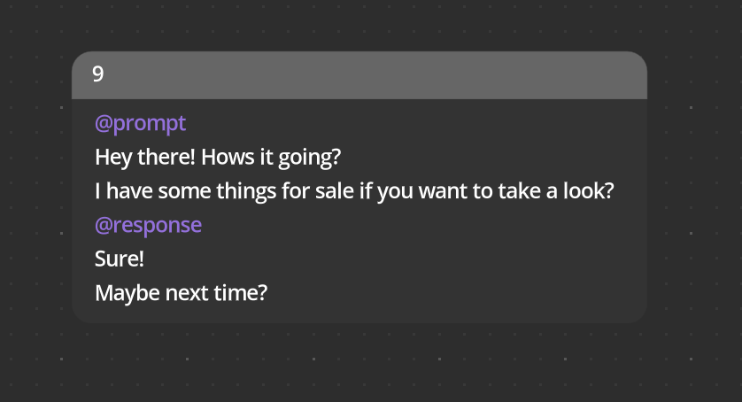
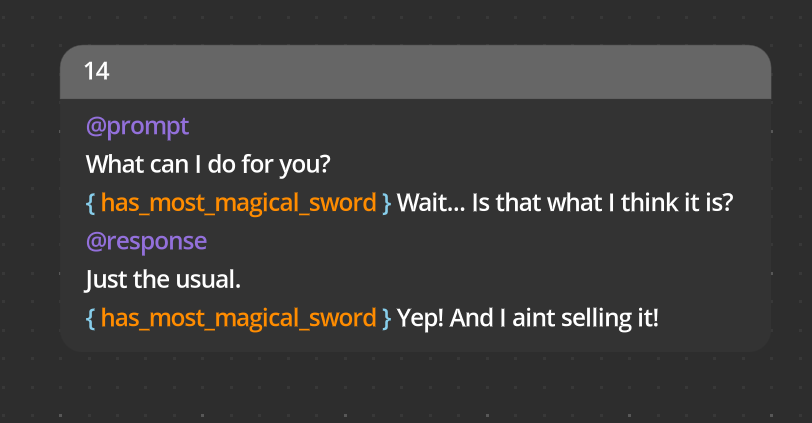
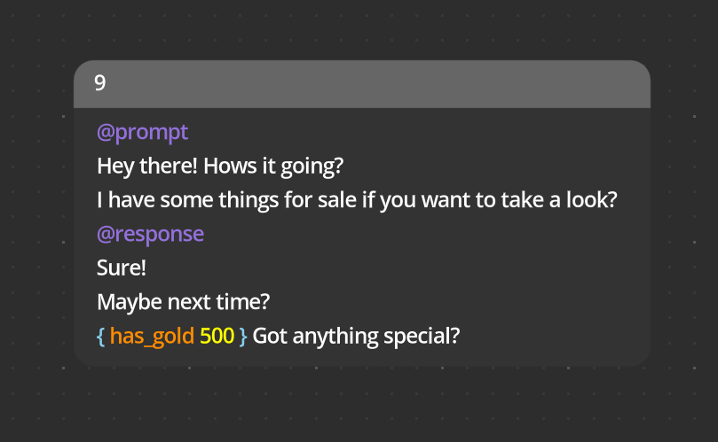
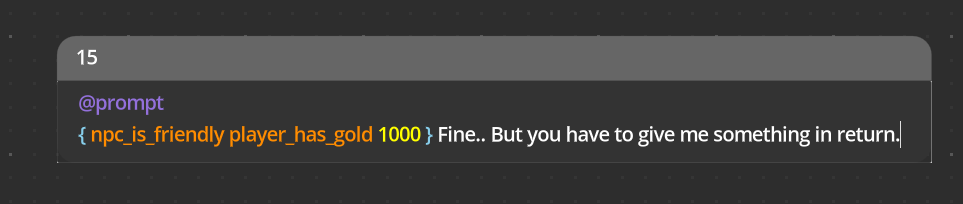
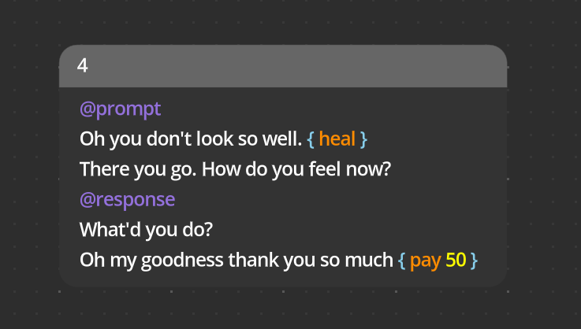
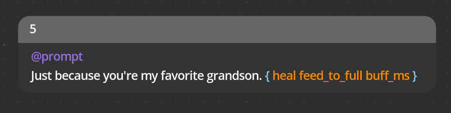

# Overview

There are only two parts in writing dialogue in a videogame, what the character says, and what the player can respond. This is done in OasisDialogue with the `@prompt` and `@response` headers.

Where each line under `@prompt` is a separately displayed line of text spoken by the character, and each line under `@response` is a separate option to be displayed to the player.

Both prompt and responses may optionally be decorated with [conditions](##conditions) and [actions](##actions).

Additionally, you can use [annotations](##annotations) to change the behavior that prompts are displayed or create easier workflows for yourself.

## conditions

If you want to show a prompt or response under a condition(s), put a `{}` with a word(s) **only containing letters and `_`** (no numbers and special characters) **before** the text to be displayed.

> The prompt `Wait... Is that what I think it is?` and response `Yep! And I ain't selling it!` will only show to the player if they have the *most magical sword*.

A condition may **optionally be succeeded by a numeric value**.

> `Got anything special?` will only show to the player if the player has at least 500 gold.

Lines are only shown **if all conditions specified are true**.

## actions

Similar to [conditions](##conditions), to execute code at runtime when a prompt is displayed or response is chosen, you put a `{}` with a word(s) **only containing letters and `_`** (no numbers and special characters) **after** the text to be displayed. And like conditions, actions may **optionally be succeeded by a numeric value**.

And may contain multiple actions.

> **Note**: Actions are executed in the order specified. For example... `{ set_gold 10 set_gold 3 }` will conclude with the player's gold being set to 3.

## naming conditions and actions

It is important to realize is that you, the writer, **make up conditions and actions**. It is then the [developer's job to hook it up](how_to_implement.gd). This gives you freedom without worrying about the actual code.

If you were writing an enemy that the player talks to...

It can be confusing who's getting hurt here. A more descriptive naming would be `damage_player` or `damage_enemy`. And another point to bring up - how much are they being damaged? If you write `damage_player 50`, is that reducing health by `50`? or reducing health to `50%`?

There is no correct way, and you can arguably overdo it with `damage_player_to_percentage 50`. 

In the end, aim for clear concise names and expect to talk to the developer to clear things up.

> There are plans to add descriptions to conditions and actions. In the meantime, good naming and communication will have to do.

## annotations

Annotations are used in 2 ways.

LEFT HERE. need to talk about default seq and provided rng. How sometimes annotations can conflict. How is the writer to know when they do?

1. To change how prompts are displayed.
2. To create *special* branches that both communicates your intention and increases your workflow.

Lets look at the first way.

Lets say you're writing an annoying kid that the player has to pester for some information. And you want to the kid to finally give up and tell the player what they need after the 3th time the player has asked. With only conditions and actions, you would do the following.

And how it would look with an annotation.
